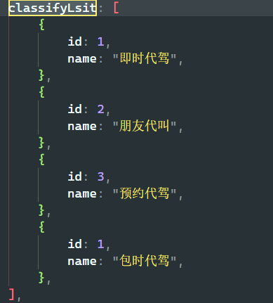

## 司机随记

### 订单线路数据获取

#### 出发地位置数据获取 

关键字 addressId 

1. 进入首页 onShow 如果存在addressId , 调用 getcfd 函数获取出发地位置数据
   1. 将位置数据存储到 this.addrlist
2. 查村附近司机
3. 判断出发地、目的地数据是否存在，都存在调用 **orderPay** 计算价格

> /app/address/getAddressInfo?addressId=id  获取出发地位置数据

#### 目的地位置数据获取

关键字 addressIds 

1. 进入首页 **onShow** 存在 addressIds ， 调用 getzd 获取目的地数据
   1. 将终点数据存储到 this.addlists 

#### 出发地 / 目的地位置数据在哪里获取的

出发地和目的数据在地址选择页面 `/my/address/index` 选择地址时获取

### 代驾下单逻辑

1. `moneyType`: 计价方式，由 **this.timeId** ，1：包时代驾  2：按时长收费

2. `indentType`: 代驾类别，由 ***this*.classifyLsit** 判断

3. 将目的地 this.addlist 和 this.addlists 相关数据赋值data，调用 `/app/indent/addIndent`，判断当前城市服务是开通
4. 轮询调用 gethaveOrder 函数，函数调用 `/app/indent/getMyHaveOrder` 接口获取是否由订单，当司机接单时，接口便会返回订单数据
   1. 查询到订单则司机已结单，跳转到订单详情页面 (/my/order/pay)

5. 寻找司机时，点击取消订单会将 **qxshow** 状态设置为false，属性用来控制确认取消订单弹出层的显示

### 属性与函数

#### 属性

- **driverShow**  寻找司机弹框状态

- ordershow 显示呼叫代驾弹框

- this.haveorder 正在进行的订单 （用户的代驾订单已被司机接单）

- this.driveshow 为寻找司机 弹出框是否显示的状态

#### 方法

- bindorderOff  取消代驾订单
- openFest 
- selectCity 根据经纬度获取城市相关信息
- getPayOrderData 计算公里数，获取价格等相关数据

> 在获取出发地或者目的地时，回去判断出发地与目的地的数据是否都存在，存在则显示呼叫代驾弹框